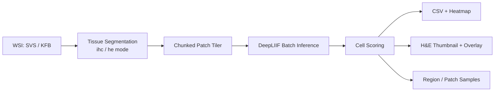

<h1 align="center">ihcinfer</h1>

<p align="center">
  <strong>Fast, patch-based IHC whole-slide inference — powered by DeepLIIF.</strong><br/>
  From IHC glass slide to cell-counting CSVs, heatmaps, and visual overlays — in one command.
</p>

<p align="center">
  <a href="README_ZH.md">中文</a> ·
  <a href="#whats-new">What's New</a> ·
  <a href="#quick-start">Quick Start</a> ·
  <a href="#documentation">Docs</a> ·
  <a href="#benchmarks">Benchmarks</a>
</p>

<p align="center">
  <a href="https://pypi.org/project/ihcinfer/">
    
  </a>
  
  
  <a href="LICENSE"></a>
</p>

<p align="center">
  
</p>

---

<a name="whats-new"></a>
## 📰 What's New

- **🚀 Unified `ihc` CLI** — one command for `tissue_seg`, `patch_infer`, and `infer`.
- **🧫 IHC Tissue Segmentation** — default `ihc` mode optimized for immunohistochemistry backgrounds; `he` mode for H&E.
- **⚡ Scoring-only Fast Path** — skip intermediate PIL images during WSI inference to lower memory and boost throughput.
- **⬇️ Automatic Model Download** — the DeepLIIF TorchScript model is downloaded from Zenodo the first time `model_dir` is omitted.
- **🧩 Cross-chunk Batch Tiling** — large slides are read in chunks and patches are batched across chunk boundaries for better GPU utilization.

---

`ihcinfer` is a lightweight Python library for batch immunohistochemistry (IHC) inference on SVS / KFB whole-slide images and PNG / JPEG patches. It reorganizes patch buffering, chunk tiling, tissue-mask pre-filtering, and a scoring-only fast path on top of DeepLIIF's TorchScript model, while exposing both a Python API (`IHCAnalyzer`) and a command-line tool (`ihc`).

---

<a name="core-features"></a>
## ✨ Core Features

| | Feature | Description |
|---|---|---|
| 🔬 | **Whole-slide image support** | Native SVS / KFB reading via OpenSlide and custom readers. |
| 🧩 | **Patch input** | Batch inference on PNG / JPEG patches or directories. |
| ⚡ | **Batch GPU inference** | Cross-chunk patch buffer improves GPU utilization on large slides. |
| 📊 | **Quantitative outputs** | Per-patch total / positive cell counts and positive ratios as CSV + coordinates. |
| 🗺️ | **Visual outputs** | Heatmaps, H&E thumbnails, overlays, region / patch samples. |
| 🧠 | **Automatic model loading** | DeepLIIF model auto-downloaded from Zenodo when `model_dir` is omitted. |
| 🧫 | **Tissue segmentation** | Standalone `ihc` / `he` tissue masks, no model required. |
| 🚀 | **Dramatic speedups** | Up to **14.79×** faster than original DeepLIIF for the full GPU pipeline. |

---

<a name="what-can-you-do"></a>
## 🧑‍🔬 What Can You Do With It?

<details>
<summary><b>🩺 Pathologist / Researcher</b> — Quantify a whole IHC slide</summary>
<br/>

```bash
ihc infer \
  --slide_path "path/to/CD3.svs" \
  --output_dir ./ihc_outputs \
  --gpu_ids 0 \
  --batch_size 8
```

Produces `patch_scoring.csv`, `heatmap.jpg`, and `overlay.jpg` for downstream statistical analysis.

</details>

<details>
<summary><b>🧬 Bioinformatician</b> — Integrate IHC scoring into a pipeline</summary>
<br/>

```python
from ihcinfer import IHCAnalyzer
import pandas as pd

analyzer = IHCAnalyzer(gpu_ids=[0], batch_size=16)
result = analyzer.infer_wsi(
    slide_path="path/to/slide.svs",
    output_dir="./outputs",
)

df = pd.read_csv(result.csv_path)
```

`WSIResult` exposes paths to the CSV, heatmap, thumbnail, overlay, and sample directories directly.

</details>

<details>
<summary><b>💻 Developer</b> — Embed tissue segmentation or patch inference</summary>
<br/>

```python
from ihcinfer import segment_tissue

mask = segment_tissue("slide.svs", mode="ihc")
print(mask.mask.shape)
```

Patch-level workflow: `ihc patch_infer --input patch.png --output_dir ./out`.

</details>

<details>
<summary><b>🔒 Offline / HPC User</b> — Disable auto-download and use a local model</summary>
<br/>

```bash
export IHCINFER_MODEL_DIR="/path/to/DeepLIIF_Latest_Model"
ihc infer --slide_path slide.svs --output_dir ./out --model_dir "$IHCINFER_MODEL_DIR"
```

In Python, set `auto_download=False`.

</details>

---

<a name="supported-platforms"></a>
## 📋 Supported Platforms & Inputs

| Platform | Python | Notes |
|---|---|---|
| Linux | 3.10+ | Primary development and test platform. |
| Windows | 3.10+ | OpenSlide binaries installed automatically via `openslide-bin`. |
| macOS | 3.10+ | Requires OpenSlide to be installed on the system. |

| Input type | Formats | Usage |
|---|---|---|
| Whole-slide images | SVS, KFB | `ihc infer`, `ihc tissue_seg`, `IHCAnalyzer.infer_wsi()` |
| Patch images | PNG, JPEG | `ihc patch_infer`, `IHCAnalyzer.infer_patches()` |

**Model**: DeepLIIF TorchScript model (~3 GB). It is downloaded automatically from Zenodo the first time `model_dir` is omitted, or you can point to a local copy.

---

<a name="quick-start"></a>
## ⚡ 30-Second Quick Start

```bash
# Install
pip install ihcinfer

# 1. Tissue segmentation (no model required)
ihc tissue_seg --input "slide.svs" --output_dir ./tissue_mask --overlay

# 2. Patch inference
ihc patch_infer --input patch.png --output_dir ./patch_outputs

# 3. Whole-slide IHC inference
ihc infer --slide_path slide.svs --output_dir ./ihc_outputs --gpu_ids 0
```

<details>
<summary><b>🐍 Prefer the Python API?</b> Click to expand</summary>
<br/>

```python
from ihcinfer import IHCAnalyzer

analyzer = IHCAnalyzer(
    model_dir="/path/to/DeepLIIF_Latest_Model",  # omit to auto-download
    gpu_ids=[0],
    batch_size=16,
)

result = analyzer.infer_wsi(
    slide_path="/path/to/slide.svs",
    output_dir="/path/to/output",
)

print(result.csv_path)
print(result.heatmap_path)
print(f"Region samples: {len(result.region_sample_paths) // 2}")
print(f"Patch samples: {len(result.patch_sample_dirs)}")
```

</details>

---

<a name="python-api"></a>
## 🐍 Python API

`IHCAnalyzer` is the unified entry point for most users:

```python
from ihcinfer import IHCAnalyzer

analyzer = IHCAnalyzer(gpu_ids=[0], batch_size=16)

# Whole-slide inference
result = analyzer.infer_wsi("slide.svs", output_dir="./outputs")

# Patch inference
patch_result = analyzer.infer_patches(["p1.png", "p2.png"], output_dir="./patch_outputs")

# Tissue segmentation
mask = analyzer.segment_tissue("slide.svs", mode="ihc")
```

---

<a name="why-ihcinfer"></a>
## 🚀 Why ihcinfer?

| Metric | Original DeepLIIF | ihcinfer | Speedup |
|---|---|---|---|
| Full patch pipeline (CPU, 4 patches) | 28.54 s | 19.50 s | **1.46×** |
| Inference only (GPU) | 1.75 s | 0.55 s | **3.17×** |
| Full patch pipeline (GPU) | 10.21 s | 0.69 s | **14.79×** |
| WSI end-to-end (1453 patches, GPU, estimated) | ~10 min | ~4 min | **~2.5–3×** |

Test environment: 6× NVIDIA RTX 3090 / 24 GiB. Reproduction scripts are in [`benchmarks/`](benchmarks/).

<p align="center">
  
  
  
</p>

> Charts generated by [`benchmarks/plot_benchmarks.py`](benchmarks/plot_benchmarks.py) from the table above.

---

<a name="pipeline-architecture"></a>
## 🏗️ Pipeline Architecture



---

<a name="documentation"></a>
## 📚 Documentation & Resources

| Resource | Link | Description |
|---|---|---|
| Example scripts | [`examples/`](examples/) | Patch inference, WSI inference, and tissue-segmentation examples |
| CLI details | [`examples/README.md`](examples/README.md) | `ihc` command and subcommand reference |
| Benchmarks | [`benchmarks/`](benchmarks/) | Reproducible comparisons against original DeepLIIF |

---

<a name="cli-reference"></a>
## 🛠️ CLI Reference

```bash
ihc --help

# Subcommands
ihc tissue_seg --input <slide> --output_dir <dir> [--overlay] [--mode ihc|he]
ihc patch_infer --input <patch_or_dir> --output_dir <dir> [--model_dir <dir>]
ihc infer --slide_path <slide> --output_dir <dir> [--gpu_ids 0] [--batch_size 8]
```

---

<a name="advanced-usage"></a>
## 🔧 Advanced Usage

```python
from ihcinfer.inference import PatchInference, RegionInference
from ihcinfer.models import DeepLIIFModel
from ihcinfer.prep import Tiler, TissueSegmenter, segment_tissue
from ihcinfer.readers import create_reader
from ihcinfer.scoring import compute_scoring, extract_cells
from ihcinfer.outputs import build_patch_output, save_patch_output, build_heatmap
```

---

<a name="benchmarks"></a>
## 📈 Benchmarks

All numbers can be reproduced with the scripts in [`benchmarks/`](benchmarks/):

```bash
# Patch-level comparison (original DeepLIIF repo must be on PYTHONPATH)
PYTHONPATH=/path/to/DeepLIIF uv run python benchmarks/bench_patch_vs_original.py --device cuda:0

# Region-level comparison
PYTHONPATH=/path/to/DeepLIIF uv run python benchmarks/bench_region_inference.py

# WSI 50-patch comparison
PYTHONPATH=/path/to/DeepLIIF uv run python benchmarks/bench_wsi_50_vs_original.py

# Full IHC WSI pipeline timing
uv run python examples/infer_ihc.py \
  --slide_path /path/to/slide.svs \
  --output_dir ./ihc_outputs \
  --gpu_ids 0 --batch_size 8 \
  --patch_size 512 --region_size 2048
```

---

<a name="contributing"></a>
## 🤝 Contributing

Issues and PRs are welcome.

---

<a name="license"></a>
## 📄 License

This project is licensed under the [MIT](LICENSE) License.
