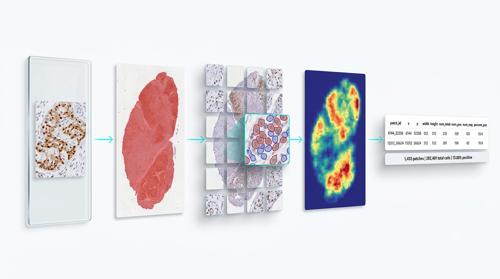
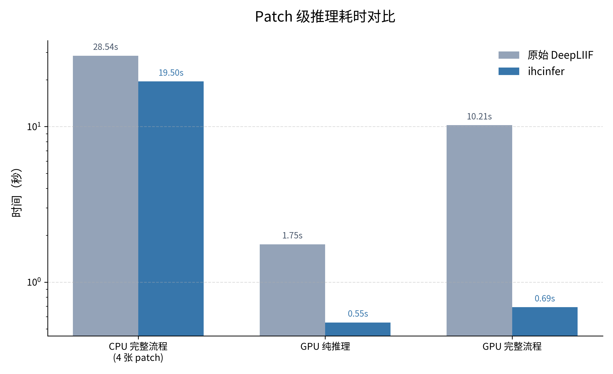
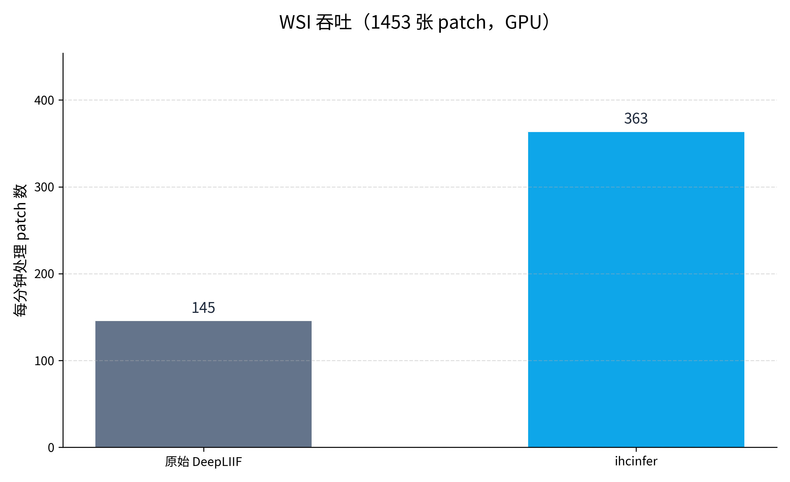
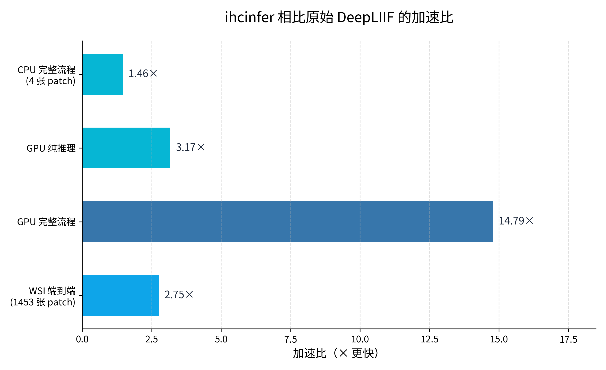
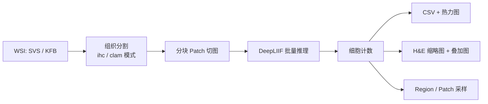

<h1 align="center">ihcinfer</h1>

<p align="center">
  <strong>基于 DeepLIIF 的快速 IHC 全片图像 patch 推理库。</strong><br/>
  从 IHC 玻璃切片到细胞计数 CSV、热力图与可视化叠加，只需一行命令。
</p>

<p align="center">
  <a href="README.md">English</a> ·
  <a href="#whats-new">最新动态</a> ·
  <a href="#quick-start">快速开始</a> ·
  <a href="#documentation">文档</a> ·
  <a href="#benchmarks">性能基准</a>
</p>

<p align="center">
  
  
  
  <a href="LICENSE"></a>
</p>

<p align="center">
  
</p>

---

<a name="whats-new"></a>
## 📰 最新动态

- **🚀 统一 `ihc` CLI** — 一条命令覆盖 `tissue_seg`、`patch_infer`、`infer` 三个场景。
- **🧫 IHC 组织分割** — 默认 `ihc` 模式，针对免疫组化背景优化；也支持 `clam` 模式处理 H&E。
- **⚡ Scoring-only 快速路径** — WSI 推理时跳过中间 PIL 图像生成，降低内存、提升吞吐。
- **⬇️ 自动下载模型** — 首次使用省略 `model_dir` 时，自动从 Zenodo 下载 DeepLIIF TorchScript 模型。
- **🧩 跨 chunk 批量切图** — 大切片按 chunk 读取并跨边界组 batch，GPU 利用率更高。

---

`ihcinfer` 是一个轻量级 Python 库，用于在 SVS / KFB 全片图像和 PNG / JPEG patch 上进行 IHC 批量推理。它在 DeepLIIF 的 TorchScript 模型之上重新组织了 patch 缓冲、chunk 切图、组织 mask 预过滤与 scoring-only 快速路径，同时提供 Python API（`IHCAnalyzer`）和命令行工具（`ihc`）。

---

<a name="core-features"></a>
## ✨ 核心功能

| | 功能 | 说明 |
|---|---|---|
| 🔬 | **全片图像支持** | 原生读取 SVS / KFB，基于 OpenSlide 与自定义 reader。 |
| 🧩 | **Patch 输入** | 直接对 PNG / JPEG patch 或目录批量推理。 |
| ⚡ | **批量 GPU 推理** | 跨 chunk 的 patch buffer，提升大切片 GPU 利用率。 |
| 📊 | **定量输出** | 每 patch 细胞总数 / 阳性数 / 阳性比例 CSV + 坐标。 |
| 🗺️ | **可视化输出** | 热力图、H&E 缩略图、叠加图、Region / Patch 采样。 |
| 🧠 | **模型自动加载** | 省略 `model_dir` 时从 Zenodo 自动下载 DeepLIIF 模型。 |
| 🧫 | **组织分割** | 独立的 `ihc` / `clam` 组织 mask，无需模型。 |
| 🚀 | **显著加速** | GPU 完整流程相比原始 DeepLIIF 最高快 **14.79×**。 |

---

<a name="what-can-you-do"></a>
## 🧑‍🔬 它能做什么？

<details>
<summary><b>🩺 病理学家 / 科研人员</b> — 对整张 IHC 切片做定量分析</summary>
<br/>

```bash
ihc infer \
  --slide_path "path/to/CD3.svs" \
  --output_dir ./ihc_outputs \
  --gpu_ids 0 \
  --batch_size 8
```

输出 `patch_scoring.csv`、`heatmap.jpg`、`overlay.jpg`，用于下游统计分析。

</details>

<details>
<summary><b>🧬 生物信息学工程师</b> — 把 IHC scoring 接入流程</summary>
<br/>

```python
from ihcinfer import IHCAnalyzer
import pandas as pd

analyzer = IHCAnalyzer(gpu_ids=[0], batch_size=16)
result = analyzer.infer_wsi(
    slide_path="path/to/slide.svs",
    output_dir="./outputs",
)

df = pd.read_csv(result.csv_path)
```

`WSIResult` 直接暴露 CSV、热力图、缩略图、叠加图和采样目录的路径。

</details>

<details>
<summary><b>💻 开发者</b> — 嵌入组织分割或 patch 推理</summary>
<br/>

```python
from ihcinfer import segment_tissue

mask = segment_tissue("slide.svs", mode="ihc")
print(mask.mask.shape)
```

Patch 级工作流：`ihc patch_infer --input patch.png --output_dir ./out`。

</details>

<details>
<summary><b>🔒 离线 / HPC 用户</b> — 关闭自动下载，使用本地模型</summary>
<br/>

```bash
export IHCINFER_MODEL_DIR="/path/to/DeepLIIF_Latest_Model"
ihc infer --slide_path slide.svs --output_dir ./out --model_dir "$IHCINFER_MODEL_DIR"
```

Python 中可设置 `auto_download=False`。

</details>

---

<a name="supported-platforms"></a>
## 📋 支持的平台与输入

| 平台 | Python | 说明 |
|---|---|---|
| Linux | 3.10+ | 主要开发与测试平台。 |
| Windows | 3.10+ | 通过 `openslide-bin` 自动安装 OpenSlide 二进制。 |
| macOS | 3.10+ | 需系统已安装 OpenSlide。 |

| 输入类型 | 格式 | 用法 |
|---|---|---|
| 全片图像 | SVS, KFB | `ihc infer`、`ihc tissue_seg`、`IHCAnalyzer.infer_wsi()` |
| Patch 图像 | PNG, JPEG | `ihc patch_infer`、`IHCAnalyzer.infer_patches()` |

**模型**：DeepLIIF TorchScript 模型（约 3 GB）。首次使用省略 `model_dir` 时自动从 Zenodo 下载，或指向本地副本。

---

<a name="quick-start"></a>
## ⚡ 30 秒快速开始

```bash
# 安装
pip install ihcinfer

# 1. 组织分割（无需模型）
ihc tissue_seg --input "slide.svs" --output_dir ./tissue_mask --overlay

# 2. Patch 推理
ihc patch_infer --input patch.png --output_dir ./patch_outputs

# 3. 全片 IHC 推理
ihc infer --slide_path slide.svs --output_dir ./ihc_outputs --gpu_ids 0
```

<details>
<summary><b>🐍 更喜欢 Python API？</b> 点击展开</summary>
<br/>

```python
from ihcinfer import IHCAnalyzer

analyzer = IHCAnalyzer(
    model_dir="/path/to/DeepLIIF_Latest_Model",  # 省略则自动下载
    gpu_ids=[0],
    batch_size=16,
)

result = analyzer.infer_wsi(
    slide_path="/path/to/slide.svs",
    output_dir="/path/to/output",
)

print(result.csv_path)
print(result.heatmap_path)
print(f"Region 采样数: {len(result.region_sample_paths) // 2}")
print(f"Patch 采样数: {len(result.patch_sample_dirs)}")
```

</details>

---

<a name="python-api"></a>
## 🐍 Python API

`IHCAnalyzer` 是面向大多数用户的统一入口：

```python
from ihcinfer import IHCAnalyzer

analyzer = IHCAnalyzer(gpu_ids=[0], batch_size=16)

# 全片推理
result = analyzer.infer_wsi("slide.svs", output_dir="./outputs")

# Patch 推理
patch_result = analyzer.infer_patches(["p1.png", "p2.png"], output_dir="./patch_outputs")

# 组织分割
mask = analyzer.segment_tissue("slide.svs", mode="ihc")
```

---

<a name="why-ihcinfer"></a>
## 🚀 为什么选择 ihcinfer？

| 指标 | 原始 DeepLIIF | ihcinfer | 加速比 |
|---|---|---|---|
| Patch 完整流程（CPU，4 张） | 28.54 s | 19.50 s | **1.46×** |
| Patch 纯推理（GPU） | 1.75 s | 0.55 s | **3.17×** |
| Patch 完整流程（GPU） | 10.21 s | 0.69 s | **14.79×** |
| WSI 端到端（1453 patches，GPU，推算） | ~10 min | ~4 min | **~2.5–3×** |

测试环境：6× NVIDIA RTX 3090 / 24 GiB。复现脚本见 [`benchmarks/`](benchmarks/)。

<p align="center">
  
  
  
</p>

> 图表由 [`benchmarks/plot_benchmarks.py`](benchmarks/plot_benchmarks.py) 根据上表数据生成。

---

<a name="pipeline-architecture"></a>
## 🏗️ 流程架构



---

<a name="documentation"></a>
## 📚 文档与资源

| 资源 | 链接 | 说明 |
|---|---|---|
| 示例脚本 | [`examples/`](examples/) | Patch 推理、WSI 推理、组织分割示例 |
| CLI 详细说明 | [`examples/README.md`](examples/README.md) | `ihc` 命令与各子命令参数 |
| 性能基准 | [`benchmarks/`](benchmarks/) | 与 original DeepLIIF 的可复现对比 |

---

<a name="cli-reference"></a>
## 🛠️ CLI 参考

```bash
ihc --help

# 子命令
ihc tissue_seg --input <slide> --output_dir <dir> [--overlay] [--mode ihc|clam]
ihc patch_infer --input <patch_or_dir> --output_dir <dir> [--model_dir <dir>]
ihc infer --slide_path <slide> --output_dir <dir> [--gpu_ids 0] [--batch_size 8]
```

---

<a name="advanced-usage"></a>
## 🔧 高级用法

```python
from ihcinfer.inference import PatchInference, RegionInference
from ihcinfer.models import DeepLIIFModel
from ihcinfer.prep import Tiler, TissueSegmenter, segment_tissue
from ihcinfer.readers import create_reader
from ihcinfer.scoring import compute_scoring, extract_cells
from ihcinfer.outputs import build_patch_output, save_patch_output, build_heatmap
```

---

<a name="benchmarks"></a>
## 📈 性能基准

所有数字均可通过 [`benchmarks/`](benchmarks/) 复现：

```bash
# Patch 级对比（需要原始 DeepLIIF 仓库在 PYTHONPATH 中）
PYTHONPATH=/path/to/DeepLIIF uv run python benchmarks/bench_patch_vs_original.py --device cuda:0

# Region 级对比
PYTHONPATH=/path/to/DeepLIIF uv run python benchmarks/bench_region_inference.py

# WSI 50-patch 对比
PYTHONPATH=/path/to/DeepLIIF uv run python benchmarks/bench_wsi_50_vs_original.py

# IHC WSI 完整流程计时
uv run python examples/infer_ihc.py \
  --slide_path /path/to/slide.svs \
  --output_dir ./ihc_outputs \
  --gpu_ids 0 --batch_size 8 \
  --patch_size 512 --region_size 2048
```

---

<a name="contributing"></a>
## 🤝 贡献

欢迎提交 Issue 和 PR。

---

<a name="license"></a>
## 📄 许可证

本项目采用 [MIT](LICENSE) 许可证。
